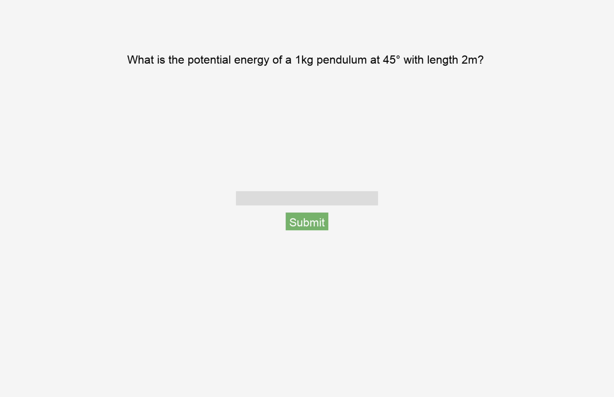

### Alexander Escobedo
### Computer Science Research Project
 
 
# Project Title
 
NewtonSim

## Description
 
NewtonSim is an interactive physics simulator for classical mechanics. It includes basic physics problems like  pendulum, spring, and wave simulations with adjustable sliders, integrated quizzes and explanations.
## Features
* Interactive pendulum, spring, and wave simulations
* Adjustable sliders for simulation parameters (speed, mass, amplitude, resistance)
* Integrated quiz questions with hints before simulations
* Detailed explanation windows following quiz attempts
* Persistent background menu visible during simulations
* Fullscreen mode for immersive experience
* Pause and reset buttons in simulations for better control
* Return to menu using ESC key


## Getting Started


### Dependencies

Before running the project, ensure you have:
* Python 3.7+
* pygame (installed via requirements.txt)

## Installing
Clone the repository:
```
git clone https://github.com/fhsuae/NewtonSim.git
```
Create and activate a virtual environment:

Windows:

```
python -m venv venv
venv\Scripts\activate
```
macOS/Linux:
```
python3 -m venv venv
source venv/bin/activate
```
Install dependencies:

```
pip install -r requirements.txt
```

 
### Executing program
Run the main program:

```
python main.py
```
> The program will start in fullscreen mode. Use the menu to select simulations or quit.

## Usage 

* Use mouse to navigate menu and interact with sliders.
* Answer quiz questions correctly to access simulations.
* Use sliders to adjust simulation parameters dynamically.
* Use Reset buttons in simulations to restart.
* Press ESC anytime to return to the main menu.

## Authors
 
Alexander Escobedo 
 
## Version History

* 0.1
    * Initial Release
 

 
## Acknowledgments
 
Inspiration, code snippets, etc.

Programming:
* [Pygame Documentation](https://www.pygame.org/docs/)
* [Python Standard Library](https://docs.python.org/3/library/)
* [Pygame Physics Simulation by Peter Collingridge](https://www.petercollingridge.co.uk/tutorials/pygame-physics-simulation/drawing-circles/)

Physics:
* [OpenStax University Physics Volume 1](https://openstax.org/details/books/university-physics-volume-1)

Inspiration:
* [PhET Interactive Simulations, University of Colorado Boulder](https://phet.colorado.edu/)
* [Simple Physics Simulation with Pygame (idgmatrix repository)](https://github.com/idgmatrix/pygame-physics)
* [Animate Dynamics of Cart-Pendulum System in Python by Using Pygame](https://github.com/AleksandarHaber/Simulation-and-Animation-of-Cart-Pole-State-Space-Model-in-Python-and-Pygame)


## Screenshots: 



 